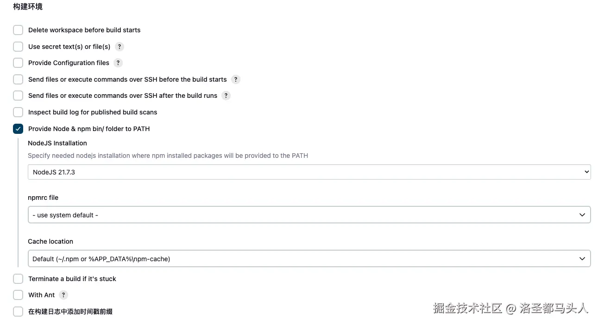

# 1.配置构建任务
首先新建一个构建任务：

接下来输入名字，选第一个就好，先建一个简单的。 
然后是一些具体的配置项：
## (1)配置保留的构建数目

这里可以配置你需要留下几个构建版本，这里我设置的是1，代表我每构建一次，上一个构建版本就会被删除。
## (2)配置构建参数
在参数化配置选项里可以配置一些自己需要的参数。

比如我这里配置的是构建的代码分支选项，后面在正式构建的时候可以进行选择。
## (3)配置代码仓库
接下来配置代码仓库的链接

选一个git仓库的链接填，这里我选用的是github的仓库，github的仓库需要先生成一个access token 才能访问到。有效期最长一年，快过期了记得替换，不然jenkins无法拉取仓库。

记得git仓库的链接要在github.com之前加上你的<i>access token和@</i>。 
下面的分支名切记要和git仓库中的分支名称对应，不然拉取失败。
## (4)Node版本设置

这里选择一个之前设置好的Node版本即可。
## (5)配置构建命令
在Build Steps中新建一个构建步骤，选择Execute NodeJS script，然后进行如何配置，选择一个你之前添加的NODE版本即可。

在Build Steps这一栏中选择新增构建步骤，然后找到执行shell并添加。

以上步骤配置完成以后可以尝试一下是否可以构建成功。
返回构建菜单执行Build。

可以在当前构建的控制台输出中查看构建的状态日志。

部署完毕以后，可以去服务器对应的目录查看一下构建产生的文件。能看到说明构建成功了。

## (6)自动部署到对应目录
经过前面的步骤,我们已经能正常的构建出来文件了,接下来要做的就是打包部署到在nginx中我们部署好的路径，这样才能正常访问到。 
接下来我们修改一下构建时的shell脚本。新增一个把dist目录压缩的步骤。

接着新增一个构建步骤，用来部署操作：

将dist.tar移动到nginx对应的项目部署目录然后解压缩，最后删除压缩包。

保存以后重新执行一次构建，然后去服务器查看发现对应的目录下已经有文件了。

接着通过nginx配置文件中映射的路径访问页面即可，如果访问不通检查你的nginx配置和项目的构建是否正确，这里有文件说明部署是OK的。  
以上就是一个简单的构建部署Web前端项目的流程，后面可以根据需要进行进一步的优化和细化。