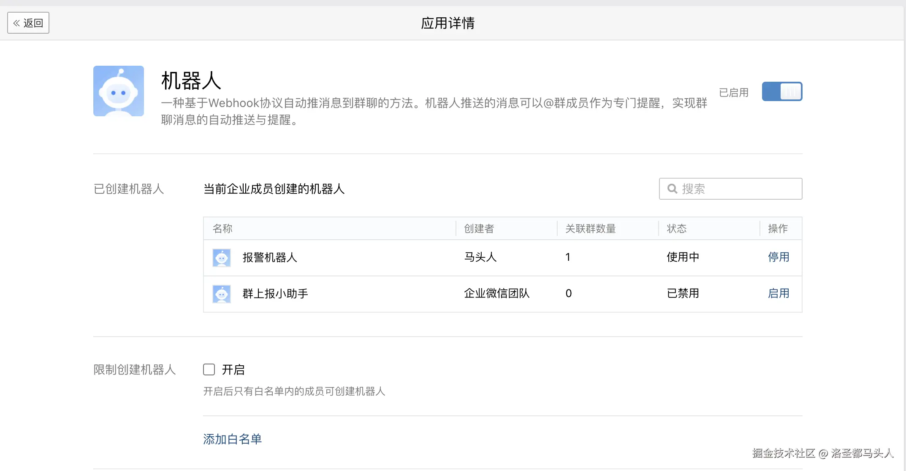

# 1.购置服务器

没啥好说的，去云平台买一个，阿里云或者腾讯云都行，我买的是阿里云的，所以这里以阿里云为例。<br><br>
购买阿里云服务器的时候会让你选一些预制的镜像配置选择，这里不建议选择预制的Docker镜像，因为默认绑定了CentOS, 在CentOS上进行配置的时候遇到了诸多问题没有解决掉，最后还是选择安装了Ubuntu, 另外网上有许多CentOS的教程，亦可以参考进行配置。

# 2.配置代理

## (1)安装shadow-socks

因为现在docker安装和拉取镜像都需要魔法上网，所以这里需要先给服务器配置个代理。*Shadowsocks*-*libev*。<br>

```shell
sudo apt update 
sudo apt upgrade  // 前两步可选，更新一下系统软件包
sudo apt install shadowsocks-libev // 安装shadowsocks
```

## (2)从你的订阅链接解析shadowsocks的配置文件

安装成功以后找一个shadowsocks代理的订阅链接。
首先我在我找到我购买的一个订阅链接，类似于<https://xxxxxxxx> 这样的，然后直接访问可以得到一个base64的字符串，decode处理以后可以得到诸如ss\://xxxxxx之类的订阅链接，比如下面这样的：<br>

```text
ss://aaaaaaaa@bbb.ccc.dddd:8888/?plugin=simple-obfs%3Bobfs%3Dhttp%3Bobfs-host%3D89911fd7104f.microsoft.com#%F0%9F%87%AD%F0%9F%87%B0%20%E9%A6%99%E6%B8%AF%2001%E4%B8%A81x%20HK
```

这样的就是一个SS的代理链接，接下来需要从中解析出来我们需要的配置信息。<br>
首先@符号之前的aaaaaaaa的部分是加密方式和密码，可以通过如下代码解析出来

```javascript
const url = 'aaaaaaaaa' // 需要处理的部分
const decodedBuffer = Buffer.from(url, 'base64').toString('utf-8');

function decrypt(data) {
  var bData = Buffer.from(data, 'base64')
  const iv = bData.slice(0, 12)
  const tag = bData.slice(-16)
  const cdata = bData.slice(12, bData.length - 16)
  const decipher = crypto.createDecipheriv('aes-192-gcm', keyStr, iv)
  decipher.setAuthTag(tag)
  var msg = decipher.update(cdata)
  const fin = decipher.final()
  const decryptedStr = new TextDecoder('utf8').decode(Buffer.concat([msg, fin]))
  return decryptedStr
}
```

最终得到的结果是aes-128-gcm:xxxxxxxx，冒号之前的部分是加密方式，之后的xxxxxx是密码。<br>
然后@后面的部分bbb.ccc.dddd:8888是代理的服务器域名和端口。接着我们可以根据SS链接和解析出的数据添加一个配置文件config.json

```json
{
  "server": "aaa.bbb.ccc", // ss链接里的服务域名
  "server_port": 12024, // ss链接里的服务端口
  "local_port": 1080, // 自己服务器启动shadowsocks代理服务的端口
  "password": "xxxxxxxxx", // 密码
  "timeout": 300, // 超时时间
  "method": "aes-128-gcm", // 加密方式，要写SS链接上的，其他加密方式不一定支持
  "plugin": "obfs-local", // 用到的插件，如果没有还得另外安装
  "plugin_opts": "xxxxxxxxxxx", // 插件的配置，复制链接上的就行，记得decode
}
```

接下来有了配置文件，我们可以在后台启动ss代理服务。首先在/etc/systemd/system/目录下新建一个ss-local.service文件，内容如下：

```text
[Unit]
Description=Shadowsocks Local Service
After=network.target

[Service]
ExecStart=/usr/bin/ss-local -c /etc/shadowsocks-libev/config.json // 这里是你的配置文件的路径
Restart=on-failure
User=root // 这里和下一行用root不用再单独设置权限
Group=root

[Install]
WantedBy=multi-user.target
```

## (3)启动并检验代理服务

创建好文件以后使用启动ss服务

```shell
sudo systemctl start ss-local // 和你的.service文件名要一致
sudo systemctl enable ss-local // 设置开机自动启动
sudo systemctl status ss-local // 查看当前服务状态
```

如果查看服务的命令返回如图，说明ss服务已经正常启动了

如图只是证明ss服务正常启动了，我们还得测试一下我们的代理是不是真的能访问，输入命令测试一下

```shell
curl -x socks5h://127.0.0.1:1080 http://google.com
```


返回以上内容说明代理请求已经通了，也可以切换其他地址测试，比如<https://www.google.com>

## (4)将socks5转为http代理

现在我们的代理虽然已经启用了，后面docker和jenkins需要http的代理，所以我们还得再处理一下。接下来我们需要安装gost。首先可以去github的gost项目页面根据自己的操作系统下载一个压缩包并解压，或者通过sudo apt install gost命令去安装。<br>
安装完成以后可以通过chmod +x gost命令确保gost文件具有可执行权限。<br>
接着在ss-local.service那个目录下新建一个gost.service文件，并配置如下内容：

```shell
[Unit]
Description=gost proxy
After=network.target

[Service]
ExecStart=/usr/local/bin/gost //你的gost的路径位置 -L http://:8888 //gost转化后的http代理的访问端口 -F socks5://:1080 //你的ss代理服务运行的端口
Restart=on-failure
User=root

[Install]
WantedBy=multi-user.target
```

配置完成以后用跟ss-local同样的方式启动gost服务，检查状态可以看到如图就是成功启动了

接着curl一下看看http代理是不是可以正常访问了

```shell
curl -x http://127.0.0.1:8888 http://google.com
```


跟ss-local一样，出现上图就是成功了

## (5)注意事项

如果curl socks5或者http代理的时候出现**curl: (52) Empty reply from server**说明ss代理可能挂了，去看看ss-local的服务状态，如果出现下面这种情况

一般通过systemctl restart ss-local重启一下服务就可以了

## (6) 配置自动重启和报警通知
如果你不想自己手动检查，希望出这样的问题了以后可以自动重启，并且告知你一下。这里选择使用shell脚本和企业微信机器人的方式。选用企业微信机器人主要是因为免费。
### 配置机器人
首先注册一个企业微信号，申请一个企业之类的，实名就可以，不是很麻烦，基本没啥要求。记得在后台开启机器人的选项。

然后在企业中拉个群，注意得再添加一个员工，两个人及以上才能变成群，必须是企微账号，拉外部的微信会变成外部群，没办法添加机器人。添加机器人之后会有一个webhook，这个webhook记好，后面要用。<br>
接着打开ss-local.service文件, 在[Service]部分新增一行:
```shell
ExecStartPost=/srv-check/ss-err-check.sh // 后面是自动检测脚本的路径 
```
这行命令的意思是在服务启动以后执行这个路径下的脚本。记得每次修改.service文件以后，都得执行一次systemctl deamon-reload才能生效。<br><br>
接着在你设置好的路径新建shell脚本编写好代码即可，我设置的比较简单，下面仅做示例：
```bash
#!/bin/bash
# 检测ss代理错误进行重启
resultMessages=''
DATE=''

# 企微报警函数
function WeChat() {
    # 发送get请求
    curl "你的企微机器人hook" \
    -H 'Content-Type: application/json' \
    -d "{\"msgtype\": \"text\",\"text\": {\"content\": \"$resultMessages\"}}"

}

while true; do
    // 如果ss-local的服务日志中有[simple-obfs\]: ERROR的信息就尝试重启
    if  journalctl -u ss-local.service | grep -q "\[simple-obfs\]: ERROR:"; then
        # 获取当前时间
        DATE=$(date +"%Y-%m-%d %H:%M:%S")
        sudo systemctl restart ss-local
        resultMessages = "[SS代理服务重启]\n\n[警报] \n时间：$DATE"
        WeChat
        // 如果重启成功
        if [ $? -eq 0 ]; then
            DATE=$(date +"%Y-%m-%d %H:%M:%S")
            resultMessages = "[SS代理重启成功]\n\n[警报] \n时间：$DATE"
            WeChat
        else
            DATE=$(date +"%Y-%m-%d %H:%M:%S")
            resultMessages = "[SS代理重启失败]\n\n[警报] \n时间：$DATE"
            WeChat
        fi
    fi
    # 每小时检查一次
    sleep 3600
done
```
脚本填写好以后重新启动一下ss-local服务即可，检测脚本就配置成功了。