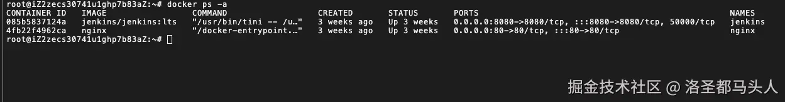

# 一、配置docker compose
## (1)创建文件目录
为了方便查找和维护，我在根目录下创建了一个docker文件夹，然后相关的文件都放在这里。
```shell
mkdir /docker
# docker compose 目录
mkdir /docker/compose
# jenkins 目录
mkdir /docker/jenkins_home
# nginx 目录
mkdir /docker/nginx
mkdir /docker/nginx/conf
# web项目目录
mkdir /docker/web
# 其中一个前端项目
mkdir /docker/mtrweb
```
## (2)配置docker-compose
在/docker/compose/目录下放一个docker-compose.yml文件，这个文件是docker compose的配置文件，文件内容如下：
```yml
version: '3'
 
networks:
  frontend:
    external: true
 
services:                                      # 容器
  docker_jenkins:
    user: root                                 # root权限
    restart: always                            # 重启方式
    image: jenkins/jenkins:lts                 # 使用的镜像
    container_name: jenkins                    # 容器名称
    privileged: true                           # 设置特权
    environment:
      - TZ=Asia/Shanghai
      - "JENKINS_OPTS=--prefix=/jenkins_home" ## 自定义 jenkins 访问前缀（上下文context）
 
    ports:                                     # 对外暴露的端口定义
      - 8080:8080
      
    volumes:                                   # 卷挂载路径
      - /docker/jenkins_home/:/var/jenkins_home     # 挂载到容器内的jenkins_home目录
      - /usr/local/bin/docker-compose:/usr/local/bin/docker-compose
  
  docker_nginx:                            # nginx环境
    restart: always
    image: nginx
    container_name: nginx
    ports:
      - 80:80
    volumes:
      - /docker/nginx/conf/nginx.conf:/etc/nginx/nginx.conf
      - /docker/web:/usr/share/nginx/web
      - /docker/nginx/logs:/var/log/nginx
```
具体配置的格式可以查看docker compose的文档，这里主要就是一些端口和文件路径的配置，这里需要注意的一点就是jenkins部分的配置一定要加一句**privileged: true**不然启动挂载jenkins的时候会因为没有权限启动失败。<br><br>
进入到docker-compose的目录下启动看看状态：
```shell
cd /docker/compose
docker-compose up-d
# 查看运行状态
docker ps -a
```

如图所示就是运行成功了，如果PORTS部分少内容，说明启动以后挂了，可以去查看容器日志。
# 二、配置nginx
在/docker/nginx/conf/目录下新建一个nginx.conf文件，内容如下:
```conf
# nginx.conf 
# main段配置信息
user  nginx;                                # 运行用户，默认即是nginx，可以不进行设置
worker_processes  2;                        # Nginx 进程数，一般设置为和 CPU 核数一样
error_log  /var/log/nginx/error.log warn;   # Nginx 的错误日志存放目录
pid        /var/run/nginx.pid;              # Nginx 服务启动时的 pid 存放位置
 
# events段配置信息 
events {
    use epoll;     # 使用epoll的I/O模型(如果你不知道Nginx该使用哪种轮询方法，会自动选择一个最适合你操作系统的)
    worker_connections  1024;  # 每个进程允许最大并发数
}
 
 
http {
    include       /etc/nginx/mime.types;
    default_type  application/octet-stream;
    # 设置日志模式 默认即可
    log_format  main  '$remote_addr - $remote_user [$time_local] "$request" '
                      '$status $body_bytes_sent "$http_referer" '
                      '"$http_user_agent" "$http_x_forwarded_for"';
 
    access_log  /var/log/nginx/access.log  main; # Nginx访问日志存放位置
 
    sendfile            on;   # 开启高效传输模式
    tcp_nopush          on;   # 减少网络报文段的数量
    keepalive_timeout   65;   # 保持连接的时间，也叫超时时间，单位秒
    gzip  on;
 
    # server段配置信息
    server {
        listen  80;               # 配置监听的端口
        server_name  localhost;   # 配置的域名
 
        location /jenkins_home/ {  
            proxy_pass http://localhost:8080;    
        }  
               
        #假设一个项目有 H5 端
        location /web {
            alias  /usr/share/nginx/web/mtrweb/dist;
            index  index.html;  
        }
    }
}
```
根据你的实际情况可以做一些改动，比如监听的端口，文件的路径之类的，每新增一个h5项目或者服务nginx这里你都需要配置一下。<br><br>
修改完配置文件以后，你需要重启一下你的容器以让改变生效，可以使用下面两种方式：
```shell
# 使用docker-compose将所有容器关闭以后全部重启
docker-compose down
docker-compose up -d
# 单独重启nginx容器
docker restart 容器id或者容器名
```
重启以后访问jenkins验证一下nginx是否配置正确，根据我这里nginx中配置的路径为服务器公网ip:8080/jenkins_home/ 如果你能正常打开页面，则说明配置成功了，如果不能检查一下jenkins的容器日志是否有报错或者检查nginx配置是否有问题，你的路径和ip是否填写正确。