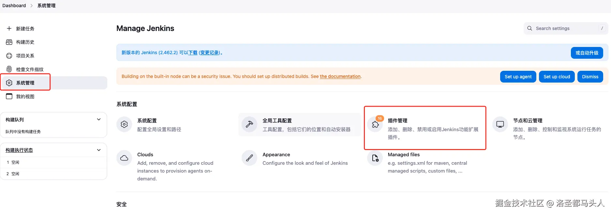
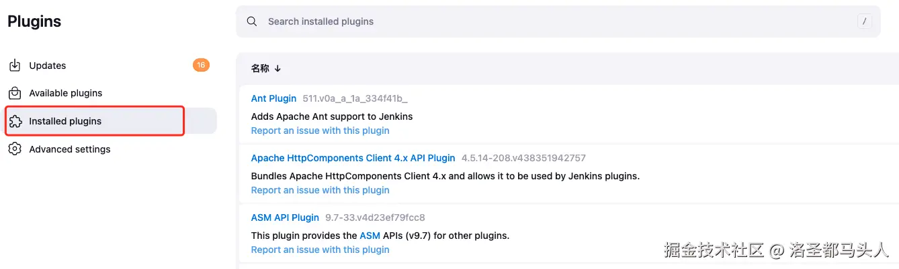
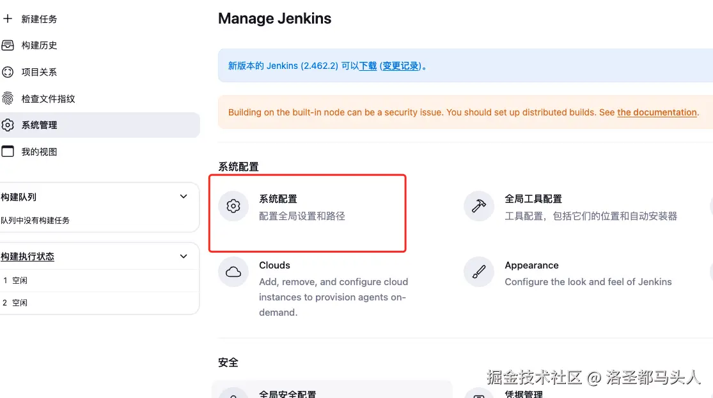
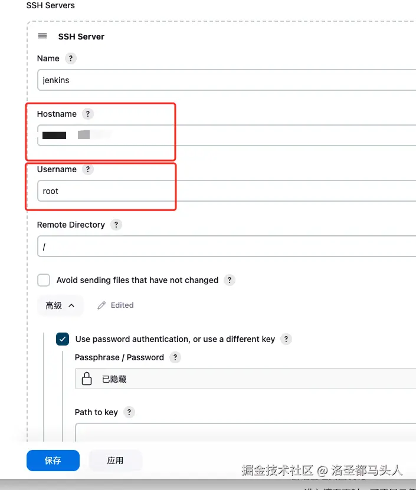
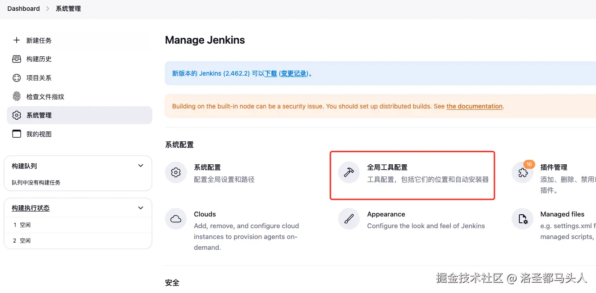
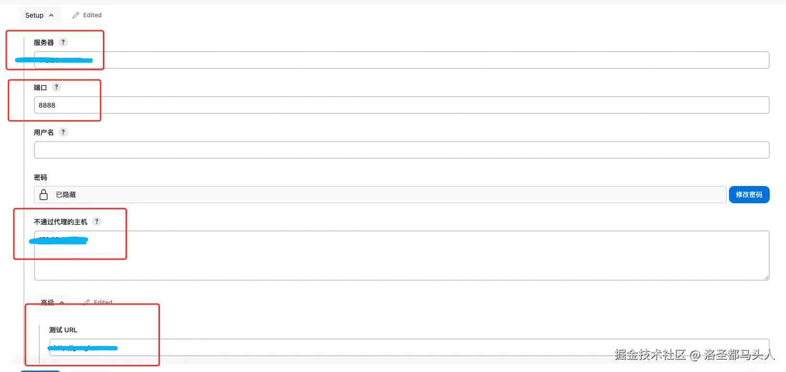
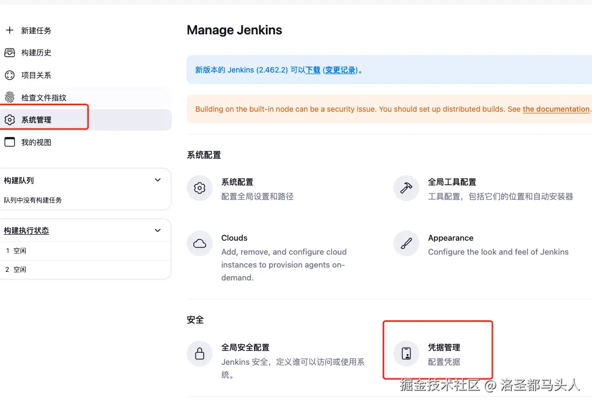

# 一、给jenkins配置插件
在上一篇中我们已经成功启动了jenkins，接下来我们需要做一些配置。<br>
首先是第一次访问jenkins页面要输入密码，会给你显示密码存放的文件位置，找到复制过来即可。<br>
第一次进入选安装推荐的插件就行，省事儿。
## (1)配置SSH插件


根据如图所示去安装插件，Publish Over SSH、NodeJS。<br><br>
接着回到设置页面，打开系统配置。

找到SSH server，选择新增然后设置相关信息，配置好以后保存并应用

hostname是自己服务器的ip，username是你服务器的用户名，密码就是登录你服务器的密码，和阿里云控制台一致。
## (2)NodeJS配置


进去全局工具配置找到NodeJS选择新增，选一个版本然后勾选自动安装，可以增加多个版本以满足不同项目的需求。设置完以后保存应用即可。<br><br>
这里可能还需要一个额外的配置，在第一节中有个可选部分是配置上网环境，如果不配置的话构建时可能会存在NodeJS下载失败的问题，可以参考我在github上写的配置上网环境。[配置上网环境](<https://github.com/lsdmtr/DOC_docker_jenkins_dep/blob/main/%E4%B8%80%E3%80%81%E7%BB%99%E6%9C%8D%E5%8A%A1%E5%99%A8%E9%85%8D%E7%BD%AE%E4%BB%A3%E7%90%86.md>)<br>
配置好以后需要在系统管理->系统配置中找到**Http Proxy Configuration**进行设置。

这里填好代理的ip地址，端口，密码（用代理的密码），不通过代理的主机跟代理的ip地址填一样即可，下面有个测试的URL，可以填一个进行测试，点击验证代理，显示成功则说明配置没问题。<br><br>
有一点需要注意的是：**这里的服务器地址不能填你的服务器公网ip或者本地ip**，因为jenkins现在是运行在容器中的，需要填宿主机的私有ip地址。<br>
另外需要进入到jenkins容器中查看与宿主机之间连接是否访问得到。
```shell
# 进入容器，最后那串是容器id
docker exec -it 085b5837124a /bin/bash
# 接着在容器中使用测试能不能访问宿主机配置的代理
curl -x 服务器私有ip:代理端口号 测试网址
```
# 二、添加凭据

去这里添加凭据，选择新增全局凭据，填入你远程仓库的账号名和密码。

点击保存，jenkins的前期准备就完成了。